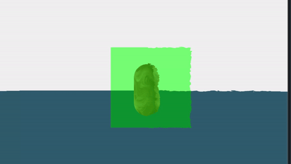

# godot_render_texture
Godot 4.3 Render Texture SubViewport Render Example

This is a simple example on how to use SubViewPorts to create post-processing effects that will include other screen-reading shaders results (the green tint).
It shows two screen reading shaders overlapping and still showing as expected. One is green-tinting, the other is distorting.
It's setup in a way, that it also shows in the editor for comfort.

Disclaimer: For simple transparency/tinting effects without distortion in real projects, please use standard shader materials with transparency, instead of screen reading shaders. It's used here for demonstrating purposes only.
